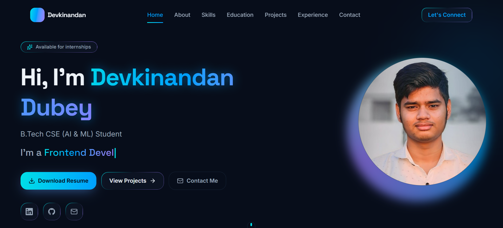

# 👨‍💻 Devkinandan Dubey — Portfolio

## 📸 Portfolio Preview

Welcome to my personal portfolio repository! 🚀

I am **Devkinandan Dubey**, a B.Tech Computer Science Engineering student specializing in **Artificial Intelligence & Machine Learning** at GLA University.

This portfolio showcases my skills, projects, education, and journey in technology.

## 🌐 Live Portfolio

🔗 **[Visit My Portfolio](https://devkinandan-dubey-portfolio.vercel.app/)**

## 👨‍🎓 About Me

- 🎓 B.Tech in Computer Science Engineering (AI & ML)
- 🏫 GLA University
- 📅 2025 – 2029
- 🤖 Currently learning Machine Learning
- 💻 Interested in AI/ML, Software Development & Web Development
- 📍 Uttar Pradesh, India

## 🛠️ Skills & Technologies

### Programming
- Python
- C
- Java

### Web Development
- HTML
- CSS
- JavaScript
- Next.js

### Database
- SQL
- MySQL

### Tools & Platforms
- Git
- GitHub
- VS Code
- Vercel

### Artificial Intelligence
- Machine Learning
- Data Analysis
- Data Visualization

## 📂 Portfolio Sections

My portfolio includes:

- 🏠 Home
- 👨‍💻 About Me
- 🛠️ Skills
- 📚 Education
- 🚀 Projects
- 📜 Certifications
- 📞 Contact

## 🚀 Project

### Personal Portfolio Website

A modern responsive portfolio website created to showcase my:

- Skills
- Education
- Projects
- Certifications
- Contact information

**Live Website:**  
https://devkinandan-dubey-portfolio.vercel.app/

## 🎯 Career Goals

I am currently looking for opportunities to learn and grow through:

- AI/ML Internships
- Software Development Internships
- Web Development Internships
- Real-world projects

## 📫 Connect With Me

- 💼 LinkedIn: [Devkinandan Dubey](https://www.linkedin.com/in/devkinandan-dubey-848017305/)
- 🐙 GitHub: [dubeydev833-create](https://github.com/dubeydev833-create)
- 📧 Email: dubeydev833@gmail.com

## ⭐ Support

If you like my portfolio, feel free to ⭐ this repository!

---

### Built with ❤️ by Devkinandan Dubey
